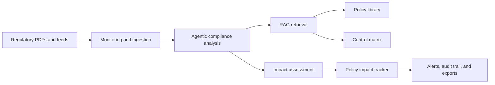

# Policy Compliance Tracker

[](https://www.python.org/)
[](https://streamlit.io/)
[](https://langchain-ai.github.io/langgraph/)
[](LICENSE.txt)

A compliance monitoring application for legal and compliance operations. The project analyzes regulatory updates, maps them to internal policies and controls, and creates a policy impact tracker for policy-review and remediation workflow.

This is a research and demonstration application, not legal advice, a compliance certification tool, or an official legal crosswalk.

## Project Scope

- Sub-domain / Process: Compliance monitoring
- AI Focus: Agentic AI
- Business Function: Compliance
- Problem Statement: Develop a compliance agent that monitors regulatory updates and maps them to internal policies requiring change.
- Data Inputs: Regulations, policy library, control matrix
- Output: Policy impact tracker

The repository includes project-created sample policies and controls for demonstration purposes. External regulation PDFs are not committed; download them from the official sources listed in `data/regulations/README.md` if you want to use the local-folder monitoring workflow.

## Architecture



## Features

- Analyze pasted regulatory update text or upload a local PDF for one-time analysis.
- Map regulatory obligations to internal policies and controls.
- Create persistent tracker items with owner, priority, risk score, status, and evidence.
- Extract explicit regulatory obligations with deadlines when they are stated in the input.
- Store structured evidence records, retrieval diagnostics, review gates, and policy-control relationships.
- Detect duplicate regulatory updates and avoid duplicate tracker creation.
- Show when a matching tracker is already Closed or Validated.
- Scan local regulation PDFs from `data/regulations`.
- Use internal policies from `data/policies`.
- Use control data from `data/controls`.
- Store tracker data in SQLite at `compliance_db/tracker.sqlite3`.
- Manage tracker status workflow: Open, In Review, In Progress, Implemented, Validated, Closed.
- Show alerts for high-impact tracker items.
- Maintain audit trail for tracker and monitoring actions.
- Export tracker data as CSV, Excel, PDF, JSON, Markdown, and text.
- Evaluate retrieval quality through the RAG Evaluation tab.
- Use the generic GDPR + NIST Privacy Framework validation profile in `data/validation`.
- Preserve actor, action, target, condition, deadline, and source-span fields for each extracted obligation.
- Distinguish source-grounded obligations from candidate policy/control alignments instead of presenting heuristic mappings as verified facts.
- Choose Rule-Based Analysis, Ollama Local Analysis, or Google Gemini API analysis from the Analyze tab.
- Compare hybrid RAG retrieval with a reproducible keyword baseline through `research/run_experiments.py`, including precision, recall, F1, MRR, hit rate, context relevance, latency, and failure categories.
- Evaluate GDPR evidence retrieval against the CC BY 4.0 ClaimRAG-LAW benchmark through `research/evaluate_claimrag.py`, with pinned revision and hash checks.

## Technology Stack

| Area | Technology |
| --- | --- |
| Dashboard | Streamlit |
| Agent Workflow | LangGraph and LangChain |
| Retrieval | Chroma, Hugging Face embeddings, and sentence-transformers |
| Document Processing | pypdf |
| Local Storage | SQLite |
  | Analysis Engines | Deterministic rules, local/remote Ollama, or Google Gemini API |
| Exports | CSV, Excel, PDF, JSON, Markdown, and text |
| Testing | Python `unittest`, pytest, Ruff, and Bandit |

## UI Screenshots

### Analyze


Completed rule-based analysis showing the extracted obligation, evidence-backed summary, and deadline.

### Tracker


Persistent compliance register with status, priority, owner, regulator, and policy-change fields.

### Alerts


Alert history showing reviewed critical notifications and their linked tracker items.

### Automation


Operational controls for folder scans, configured feed checks, and regulator feed coverage.

### RAG Evaluation


Retrieval-quality check with the evaluation explanation and recent precision history.

### Audit Trail


Traceable event history for tracker updates and scheduled monitoring activity.

## Repository Structure

```text
policy-compliance-tracker/
|-- src/policy_compliance_tracker/
|   |-- agent/              # Regulatory analysis and impact mapping
|   |-- retrieval/          # Index building and retrieval evaluation
|   |-- ingestion/          # Local PDF and regulatory feed ingestion
|   |-- storage/            # Tracker, alert, audit, and evaluation storage
|   |-- exports/            # Tracker and report exports
|   |-- providers/          # Rule-based, Ollama, and Gemini providers
|   `-- config.py           # Application configuration
|-- app/
|   |-- dashboard.py        # Streamlit dashboard
|   `-- demo_end_to_end.py  # Local end-to-end demonstration
|-- data/                   # Regulations, policies, and control PDFs
|-- research/               # Dataset, experiments, metrics, and paper notes
|-- tests/                  # Automated tests
|-- docs/
|   |-- screenshots/        # Dashboard screenshots used in this README
|   `-- architecture.md     # System architecture
|-- pyproject.toml          # Editable package configuration
|-- .gitignore              # Excluded local and generated files
|-- README.md               # Project documentation
`-- requirements.txt        # Python dependencies
```

## Installation and Run

Python 3.11 or later is required.

Clone the repository and open its folder:

```bash
git clone https://github.com/gunargrithvick/policy-compliance-tracker.git
cd policy-compliance-tracker
```

Install dependencies:

```bash
pip install -r requirements.txt
```

For development and the complete audit/research tooling:

```powershell
pip install -r requirements-dev.txt
```

### Add Regulation PDFs (Optional)

The public repository does not redistribute the externally sourced regulation PDFs used during local demonstrations. Download the documents from the official sources listed in [`data/regulations/README.md`](data/regulations/README.md), save them in `data/regulations`, and then use the Automation tab to scan them. You can also paste regulation text or upload a PDF directly in the Analyze tab.

### Run the Automated Tests

```powershell
python -m pytest -q
python -m unittest discover -s tests -v
```

### Run the Local Demonstration

```powershell
python app/demo_end_to_end.py
```

### Build or Rebuild the Retrieval Index

Rebuilding replaces only the Chroma collection and preserves tracker records:

```bash
python -m policy_compliance_tracker.retrieval.ingest
```

Run one local monitoring cycle without external feeds:

```bash
python -m policy_compliance_tracker.ingestion.scheduled_monitor --once --skip-feeds
```

When external feeds are enabled, ingestion retries failed requests, tries configured official fallback pages, and reuses the last cached feed page when the live source is temporarily unavailable. If a regulator moves to a completely new unconfigured domain, update the feed configuration in `src/policy_compliance_tracker/ingestion/regulatory_feeds.py`.

Run the retrieval evaluation after building the retrieval index:

```bash
python research/run_experiments.py
```

The experiment compares hybrid RAG, direct semantic top-k, and a keyword baseline. It writes per-case JSON/CSV results to `research/results/` and reports cold-start and warm-run latency.

Run the controlled retrieval-component ablation:

```powershell
python research/run_ablation.py
```

This compares semantic-only retrieval, semantic plus lexical overlap, semantic plus lexical and source-role scoring, and the full production hybrid selector on the same 200 cases.

Run the end-to-end policy/control mapping evaluation:

```bash
python research/evaluate_end_to_end.py
```

Run the separate open legal-benchmark evaluation:

```powershell
python research/evaluate_claimrag.py
```

Run the same pinned legal passages through the complete in-memory tracker flow:

```powershell
python research/evaluate_claimrag_pipeline.py
```

This reports structural completion and review-gate behavior. It does not write
benchmark cases to the tracker database, and it does not claim that
organization-specific policy/control mappings are externally validated.

To run all research evaluations and tests together:

```powershell
python research/run_gap_suite.py
```

This downloads the pinned ClaimRAG-LAW GDPR files into the ignored
`data/benchmarks/claimrag_law` directory and records attribution, license,
revision, and hashes. It evaluates legal evidence retrieval only; it does not
turn the project's policy/control mappings into verified or official mappings.

The evaluation set, validation profile, evidence tiers, metrics, protocol, and limitations are documented in `research/README.md` and `research/validation_protocol.md`.

### Generic validation profile

The primary research scope is GDPR obligation extraction with the NIST Privacy Framework Core 1.0 as a public control vocabulary. The downloaded source files are stored at:

- `data/regulations/EU_GDPR_Regulation.pdf`
- `data/frameworks/NIST_Privacy_Framework_Core_v1.0.pdf`

The NIST Privacy Framework is voluntary guidance, not a law. The application labels mappings as `framework_supported`, `candidate_alignment`, or `needs_review`; it does not claim legal certification.

Start the dashboard:

```bash
python -m streamlit run app/dashboard.py
```

Open:

```text
http://localhost:8501/
```

The dashboard is configured to bind to localhost by default. Do not expose it
to a public or shared network without adding authentication and reviewing the
data-handling implications of uploaded regulatory and policy documents.

## Clear Tracker Data

Use this command to clear tracker items, notifications, and audit rows:

```bash
python -c "from policy_compliance_tracker.storage.tracker_store import clear_tracker_data; print(clear_tracker_data())"
```

## API Configuration

To use Google Gemini analysis, copy `.env.example` to `.env` and add your own key:

```env
GEMINI_API_KEY=your_gemini_api_key_here
GEMINI_MODEL=gemini-3.6-flash
```

Restart the dashboard after changing the key, then select Google Gemini API in the Analyze tab. On Streamlit Community Cloud, add the key through the app's Secrets settings. Rule-Based Analysis remains the default provider. Never commit `.env` or a real API key; only `.env.example` belongs in source control.

The dashboard provider is selected explicitly in the Analyze tab. The `AI_PROVIDER` setting is used by programmatic analysis calls that do not pass a provider directly.

If a Gemini key was ever committed, revoke it in Google AI Studio and create a
new key. Removing `.env` from the current checkout does not erase old Git
history or invalidate an already issued key.

## Optional Ollama Local Mode

The default analysis path uses the rule-based provider for fast tracker creation. To enable Ollama-based LLM analysis:

Install Ollama on your machine first. The Python dependencies include the Ollama client library, but the local Ollama server and model must be available separately.

Run `ollama serve` in a separate terminal. Then, in the project terminal, pull the model and start the dashboard:

Model used for optional LLM analysis: `qwen2.5:1.5b`.

```powershell
ollama pull qwen2.5:1.5b
python -m streamlit run app/dashboard.py
```

In the dashboard's Analyze tab, select `Ollama Local/Cloud API` as the Analysis Engine.

## Optional Ollama Cloud API Mode

Streamlit Community Cloud cannot reach Ollama running on your PC. The app can instead call Ollama's hosted API when you configure:

```env
OLLAMA_BASE_URL=https://ollama.com/api
OLLAMA_API_KEY=your_ollama_api_key_here
OLLAMA_MODEL=gpt-oss:20b
```

Add these values to Streamlit Community Cloud Secrets or your local `.env`, then select `Ollama Local/Cloud API`. Keep the API key private and use a model available to your Ollama account. If `OLLAMA_BASE_URL` is omitted, the app uses the local server at `http://localhost:11434/api`.

## Final Evaluation Artifacts

The 200 cases in `research/evaluation_cases.json` include the original 30-case frozen baseline plus an expanded evaluation set covering security, privacy, continuity, data governance, financial-crime, multi-policy, and no-match scenarios. Running the research commands generates timestamped retrieval comparisons, end-to-end mapping results, label consistency checks, manual-review checks, and ClaimRAG-LAW benchmark results in `research/results/`; these generated files are intentionally excluded from Git and can be recreated locally. The 200 project cases remain project-maintained and should not be described as independently validated. ClaimRAG-LAW is reported separately under its CC BY 4.0 attribution terms.

## Author

Guna Rithvick

## License

This project is available under the [MIT License](LICENSE.txt).
