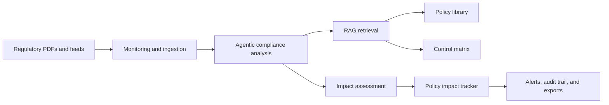
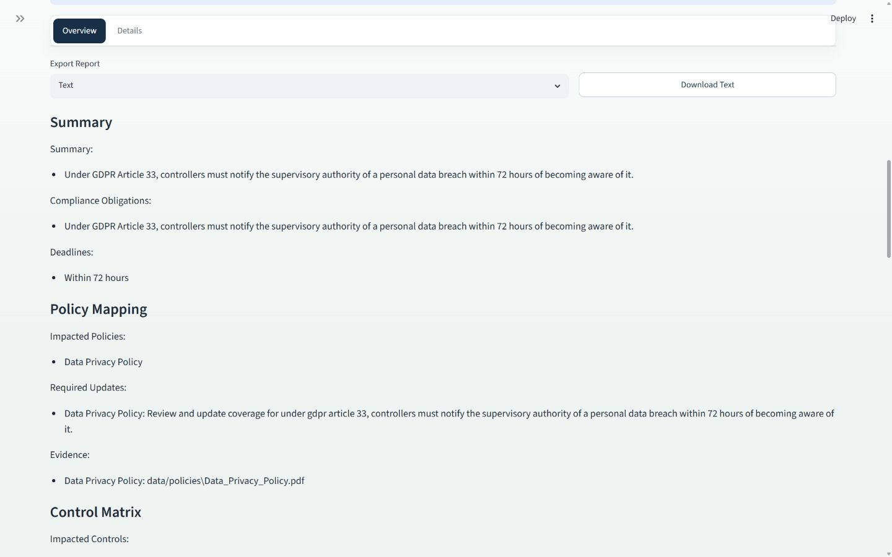
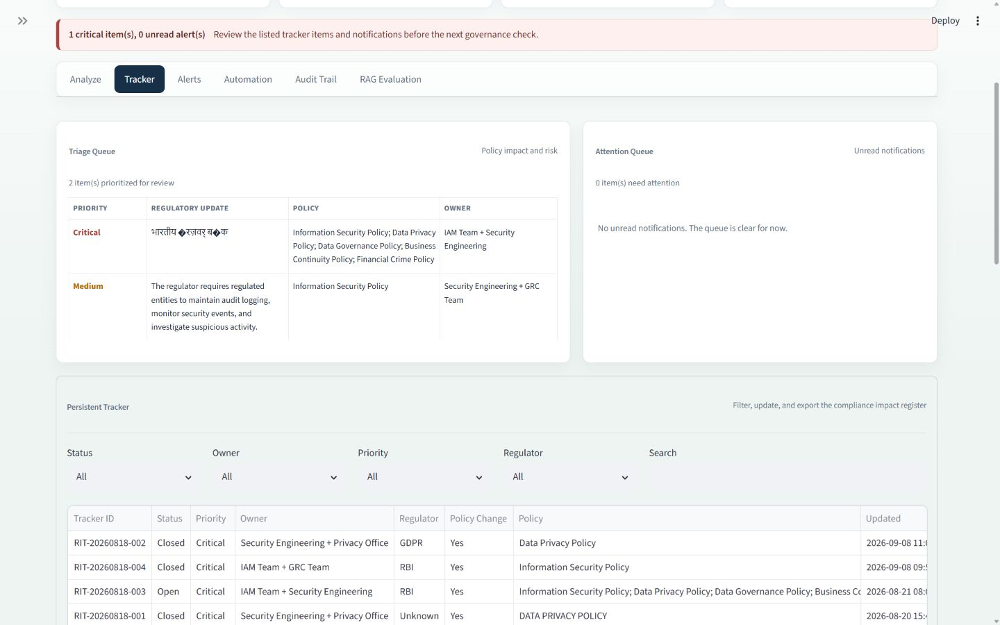
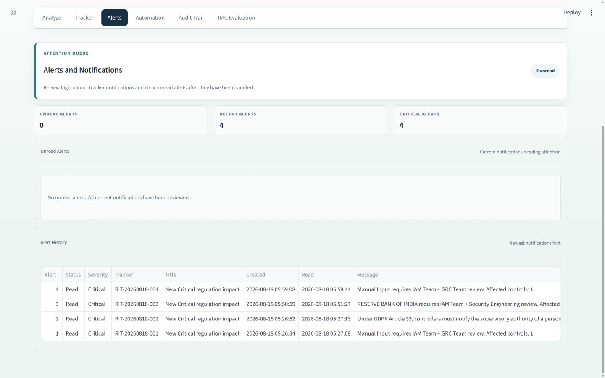
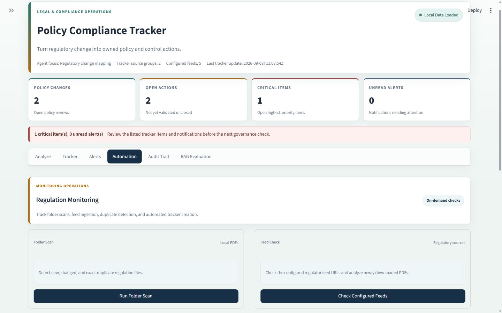
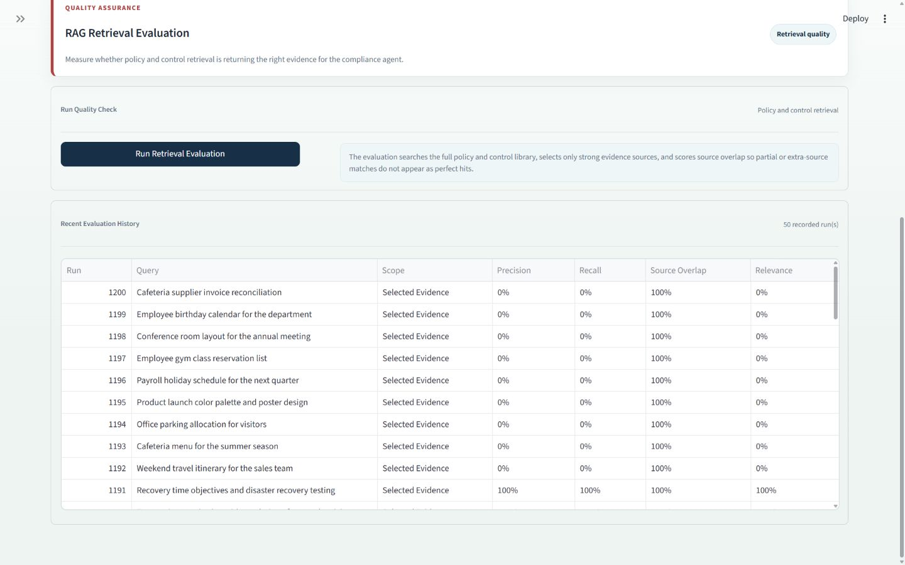
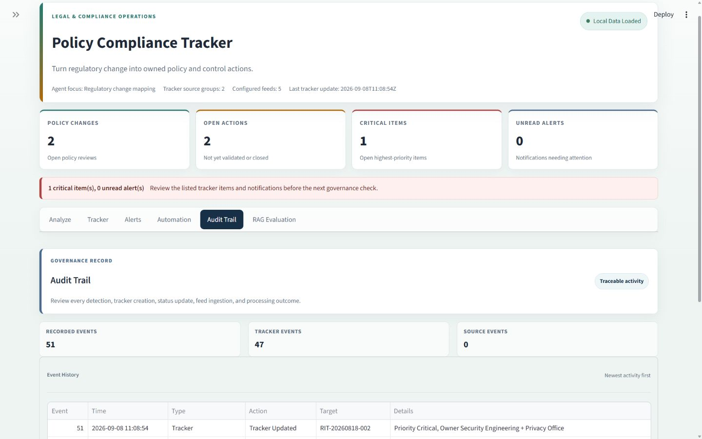

# Policy Compliance Tracker

[](https://www.python.org/)
[](https://streamlit.io/)
[](https://langchain-ai.github.io/langgraph/)
[](LICENSE.txt)

A compliance monitoring application for legal and compliance operations. The project analyzes regulatory updates, maps them to internal policies and controls, and creates a policy impact tracker for policy-review and remediation workflow.

## Project Scope

- Sub-domain / Process: Compliance monitoring
- AI Focus: Agentic AI
- Business Function: Compliance
- Problem Statement: Develop a compliance agent that monitors regulatory updates and maps them to internal policies requiring change.
- Data Inputs: Regulations, policy library, control matrix
- Output: Policy impact tracker

The repository includes sample regulations, policies, and controls for demonstration purposes.

## Architecture



## Features

- Analyze pasted regulatory update text or upload a local PDF for one-time analysis.
- Map regulatory obligations to internal policies and controls.
- Create persistent tracker items with owner, priority, risk score, status, and evidence.
- Extract explicit regulatory obligations with deadlines when they are stated in the input.
- Store structured evidence records, retrieval diagnostics, review gates, and policy-control relationships.
- Detect duplicate regulatory updates and avoid duplicate tracker creation.
- Show when a matching tracker is already Closed or Validated.
- Scan local regulation PDFs from `data/regulations`.
- Use internal policies from `data/policies`.
- Use control data from `data/controls`.
- Store tracker data in SQLite at `compliance_db/tracker.sqlite3`.
- Manage tracker status workflow: Open, In Review, In Progress, Implemented, Validated, Closed.
- Show alerts for high-impact tracker items.
- Maintain audit trail for tracker and monitoring actions.
- Export tracker data as CSV, Excel, PDF, JSON, Markdown, and text.
- Evaluate retrieval quality through the RAG Evaluation tab.
- Choose Rule-Based Analysis, Ollama Local Analysis, or Google Gemini API analysis from the Analyze tab.
- Compare hybrid RAG retrieval with a reproducible keyword baseline through `research/run_experiments.py`, including precision, recall, F1, MRR, hit rate, context relevance, latency, and failure categories.

## Technology Stack

| Area | Technology |
| --- | --- |
| Dashboard | Streamlit |
| Agent Workflow | LangGraph and LangChain |
| Retrieval | Chroma, Hugging Face embeddings, and sentence-transformers |
| Document Processing | pypdf |
| Local Storage | SQLite |
| Analysis Engines | Deterministic rules, Ollama `qwen2.5:1.5b`, or Google Gemini API |
| Exports | CSV, Excel, PDF, JSON, Markdown, and text |
| Testing | Python `unittest` |

## UI Screenshots

### Analyze



### Tracker



### Alerts



### Automation



### RAG Evaluation



### Audit Trail



## Repository Structure

```text
policy-compliance-tracker/
|-- src/policy_compliance_tracker/
|   |-- agent/              # Regulatory analysis and impact mapping
|   |-- retrieval/          # Index building and retrieval evaluation
|   |-- ingestion/          # Local PDF and regulatory feed ingestion
|   |-- storage/            # Tracker, alert, audit, and evaluation storage
|   |-- exports/            # Tracker and report exports
|   |-- providers/          # Rule-based, Ollama, and Gemini providers
|   `-- config.py           # Application configuration
|-- app/
|   |-- dashboard.py        # Streamlit dashboard
|   `-- demo_end_to_end.py  # Local end-to-end demonstration
|-- data/                   # Regulations, policies, and control PDFs
|-- research/               # Dataset, experiments, metrics, and paper notes
|-- tests/                  # Automated tests
|-- docs/
|   |-- screenshots/        # Dashboard screenshots used in this README
|   `-- architecture.md     # System architecture
|-- pyproject.toml          # Editable package configuration
|-- .gitignore              # Excluded local and generated files
|-- README.md               # Project documentation
`-- requirements.txt        # Python dependencies
```

## Installation and Run

Python 3.11 or later is required.

Clone the repository and open its folder:

```bash
git clone https://github.com/gunargrithvick/policy-compliance-tracker.git
cd policy-compliance-tracker
```

Install dependencies:

```bash
pip install -r requirements.txt
pip install -e .
```

Run the automated tests:

```powershell
python -m unittest discover -s tests -v
```

Build or rebuild the retrieval index. Rebuilding replaces only the Chroma collection and preserves tracker records:

```bash
python -m policy_compliance_tracker.retrieval.ingest
```

Run one local monitoring cycle without external feeds:

```bash
python -m policy_compliance_tracker.ingestion.scheduled_monitor --once --skip-feeds
```

Run the retrieval evaluation after building the retrieval index:

```bash
python research/run_experiments.py
```

The experiment compares hybrid RAG, direct semantic top-k, and a keyword baseline. It writes per-case JSON/CSV results to `research/results/` and reports cold-start and warm-run latency.

Run the controlled retrieval-component ablation:

```powershell
python research/run_ablation.py
```

This compares semantic-only retrieval, semantic plus lexical overlap, semantic plus lexical and source-role scoring, and the full production hybrid selector on the same 200 cases.

Run the end-to-end policy/control mapping evaluation:

```bash
python research/evaluate_end_to_end.py
```

The evaluation set, label-review process, metrics, protocol, and limitations are documented in `research/README.md`.

Start the dashboard:

```bash
python -m streamlit run app/dashboard.py
```

Open:

```text
http://localhost:8501/
```

## Clear Tracker Data

Use this command to clear tracker items, notifications, and audit rows:

```bash
python -c "from policy_compliance_tracker.storage.tracker_store import clear_tracker_data; print(clear_tracker_data())"
```

## Optional LLM Mode

The default analysis path uses the rule-based provider for fast tracker creation. To enable Ollama-based LLM analysis:

Install Ollama on your machine first. The Python dependencies include the Ollama client library, but the local Ollama server and model must be available separately.

Run `ollama serve` in a separate terminal. Then, in the project terminal, run:

Model used for optional LLM analysis: `qwen2.5:1.5b`.

```powershell
ollama pull qwen2.5:1.5b
$env:AI_PROVIDER="ollama"
python -m streamlit run app/dashboard.py
```

## Optional Google Gemini Mode

Create a file named `.env` in the project root, add a Gemini API key, and restart the dashboard. The Analyze tab lets the user select Gemini explicitly; the application never switches to it silently.

```env
GEMINI_API_KEY=your_new_key_here
GEMINI_MODEL=gemini-3.6-flash
```

The `.env` file is private and is excluded from Git. The default model is `gemini-3.6-flash` and can be changed with `GEMINI_MODEL`.

## Final Evaluation Artifacts

The 200 cases in `research/evaluation_cases.json` include the original 30-case frozen baseline plus an expanded evaluation set covering security, privacy, continuity, data governance, financial-crime, multi-policy, and no-match scenarios. Running the research commands generates timestamped retrieval comparisons, end-to-end mapping results, label consistency checks, and manual-review checks in `research/results/`; these generated files are intentionally excluded from Git and can be recreated locally. The labels remain project-maintained and should not be described as independently validated without a separate compliance review.

## Author

Guna Rithvick

## License

This project is available under the [MIT License](LICENSE.txt).
