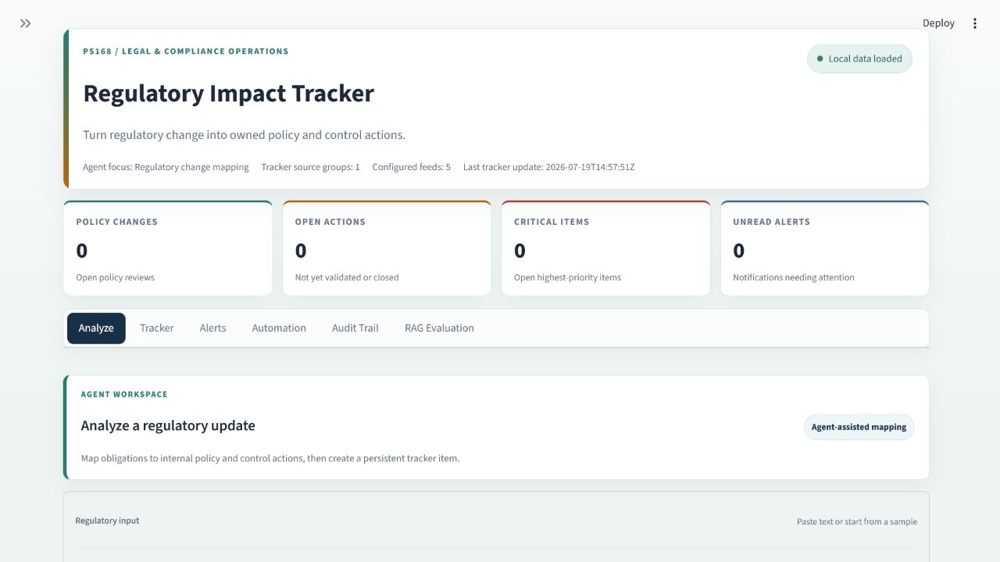
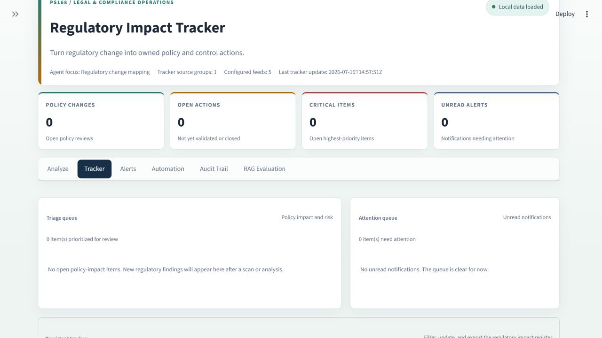
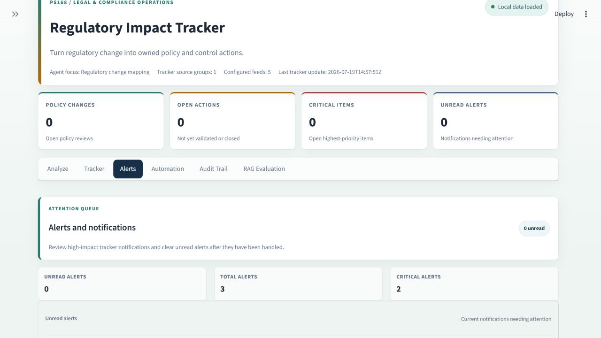
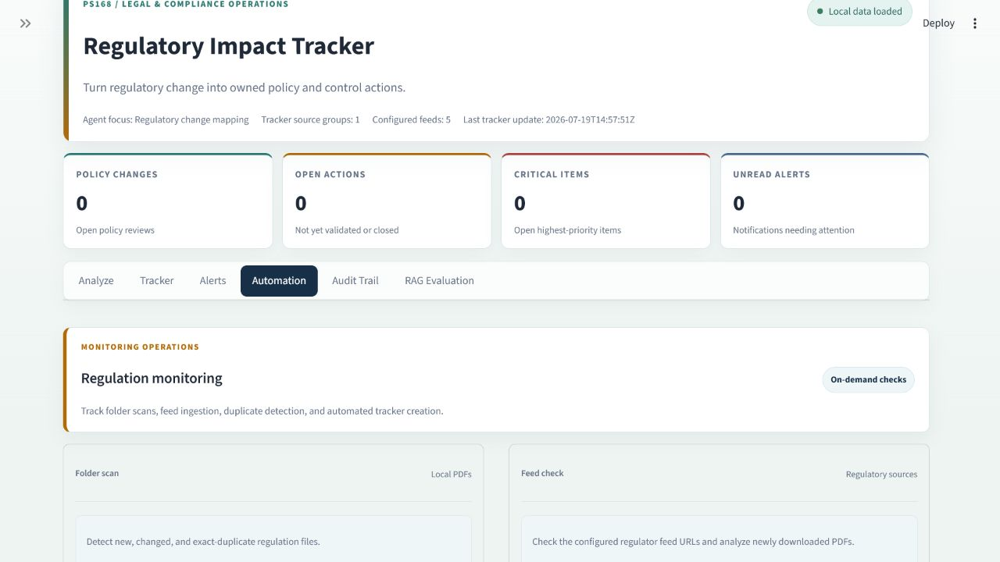
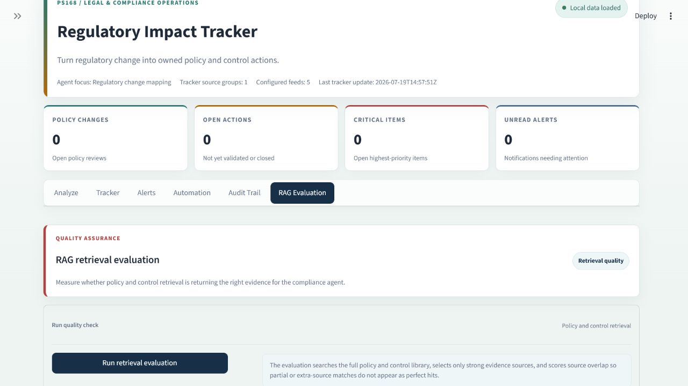
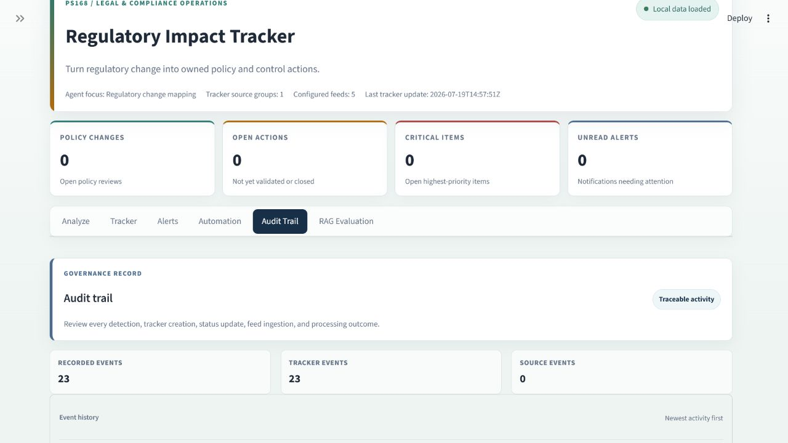

# Regulatory Impact Tracker

A compliance monitoring application for PS168 Legal & Compliance. The project analyzes regulatory updates, maps them to internal policies and controls, and creates a regulatory impact tracker for policy-review and remediation workflow.

## Project Scope

- Sub-domain / Process: Compliance monitoring
- AI Focus: Agentic AI
- Business Function: Compliance
- Problem Statement: Develop a compliance agent that monitors regulatory updates and maps them to internal policies requiring change.
- Data Inputs: Regulations, policy library, control matrix
- Output: Regulatory impact tracker

## Features

- Analyze pasted regulatory update text.
- Map regulatory obligations to internal policies and controls.
- Create persistent tracker items with owner, priority, risk score, status, and evidence.
- Detect duplicate regulatory updates and avoid duplicate tracker creation.
- Show when a matching tracker is already Closed or Validated.
- Scan local regulation PDFs from `data/regulations`.
- Use internal policies from `data/policies`.
- Use control data from `data/controls`.
- Store tracker data in SQLite at `compliance_db/tracker.sqlite3`.
- Manage tracker status workflow: Open, In Review, In Progress, Implemented, Validated, Closed.
- Show alerts for high-impact tracker items.
- Maintain audit trail for tracker and monitoring actions.
- Export tracker data as CSV, Excel, PDF, JSON, Markdown, and text.
- Evaluate retrieval quality through the RAG Evaluation tab.

## UI Screenshots

### Analyze



### Tracker



### Alerts



### Automation



### RAG Evaluation



### Audit Trail



## Run

Install dependencies:

```bash
pip install -r requirements.txt
```

Build or rebuild the retrieval index:

```bash
python ingest.py
```

Run one local monitoring cycle without external feeds:

```bash
python scheduled_monitor.py --once --skip-feeds
```

Start the dashboard:

```bash
python -m streamlit run dashboard.py
```

Open:

```text
http://localhost:8501/
```

## Clear Tracker Data

Use this command to clear tracker items, notifications, and audit rows:

```bash
python -c "from tracker_store import clear_tracker_data; print(clear_tracker_data())"
```

## Optional LLM Mode

The default analysis path is optimized for fast tracker creation. To enable Ollama-based LLM analysis:

Install Ollama on your machine first. The Python dependencies include the Ollama client library, but the local Ollama server and model must be available separately.

Model used for optional LLM analysis: `qwen2.5:1.5b`.

```bash
ollama pull qwen2.5:1.5b
ollama serve
$env:USE_LLM_ANALYSIS="1"
python -m streamlit run dashboard.py
```

## Main Files

- `dashboard.py` - Streamlit dashboard UI.
- `compliance_agent.py` - Regulatory analysis and policy/control mapping logic.
- `tracker_store.py` - SQLite storage for trackers, alerts, audit trail, and RAG evaluation history.
- `regulation_monitor.py` - Local PDF scanning, duplicate detection, and tracker creation.
- `regulatory_feeds.py` - Configured regulatory feed ingestion.
- `scheduled_monitor.py` - One-shot or scheduled monitoring runner.
- `ingest.py` - Builds the retrieval index from regulation, policy, and control PDFs.
- `exports.py` - Export generation for tracker and analysis outputs.
- `rag_eval.py` - Retrieval evaluation logic.
- `demo_end_to_end.py` - Local end-to-end demo runner.
