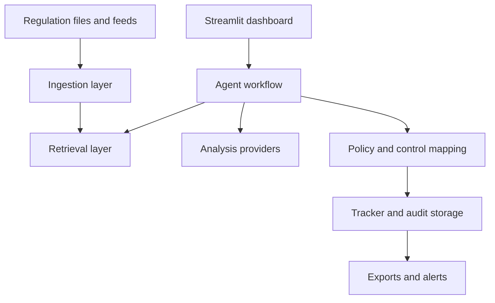

# System Architecture

The application follows a small layered structure:

- `agent/` coordinates regulation analysis and impact mapping.
- `retrieval/` builds the document index and evaluates retrieval methods.
- `ingestion/` processes local PDFs and configured regulatory feeds.
- `storage/` manages trackers, alerts, audit events, and evaluation records.
- `exports/` creates downloadable tracker and report formats.
- `providers/` contains the rule-based, Ollama, and Gemini provider integration.
- `app/` contains the Streamlit user interface and demonstration entry points.
